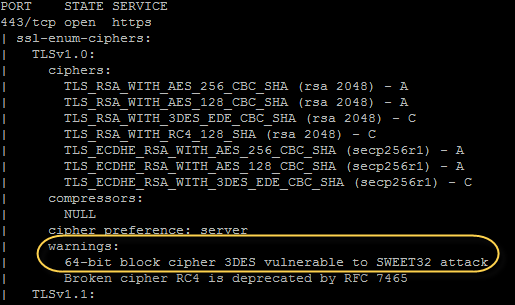
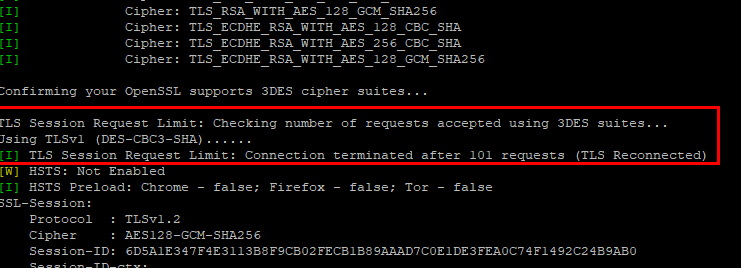

# SSL/TLS

## Audit SSL/TLS

### SSLscan


```bash
# Single Host
sslscan --show-ciphers --no-failed --show-certificate --xml=sslscan_out.xml <HOST>:<PORT>

# Target List
sslscan --show-ciphers --no-failed --show-certificate --xml=sslscan_out.xml --targets=targetlist.txt
```


### TLSled


```bash
tlssled <IP> <PORT>
```


### SSLyze


```bash
sslyze --http_headers --json_out=File.json <HOST>:<PORT>
```


## SSLlabs

[https://www.ssllabs.com/ssltest/index.html](https://www.ssllabs.com/ssltest/index.html)

### SSLscan


```bash
# Single Host
sslscan --show-ciphers --no-failed --show-certificate --xml=sslscan_out.xml <HOST>:<PORT>

# Target List
sslscan --show-ciphers --no-failed --show-certificate --xml=sslscan_out.xml --targets=targetlist.txt
```


### TLSed


```bash
tlssled <IP> <PORT>
```


### SSLyze


```bash
sslyze --http_headers --regular --json_out=File.json <HOST>:<PORT>
```


### SSLlabs

[https://www.ssllabs.com/ssltest/index.html](https://www.ssllabs.com/ssltest/index.html)

## HSTS

### Nmap


```bash
nmap -p 443 --script http-hsts-verify -Pn -v -oA http-hsts-verify <TARGET>
```


###


```bash
nmap -p 443 --script http-hsts-verify -Pn -v -oA http-hsts-verify <TARGET>
```


### Curl


```bash
curl -I -k https://xxx.xxx.com
```



cURL should show a header like `Strict-Transport-Security: max-age=15552000; preload`


## POODLE

### Nmap

```
nmap -sV --version-light --script ssl-poodle -p <PORT> <TARGET>
```


More Info: http://nmap.org/nsedoc/scripts/ssl-poodle.html


## SSL DROWN



```bash
nmap -sV --script=sslv2-drown -p 443 -Pn -v -oA sslv2-drown <TARGET>
```



## HEARTBLEED



```bash
nmap --script ssl-heartbleed --script-args vulns.showall -oA ssl-heartbleed -Pn -p <PORT> -sV <TARGET>
```




More Info:

* https://gist.github.com/bonsaiviking/10402038
* http://nmap.org/nsedoc/scripts/ssl-heartbleed.html


## Get Certificates



```bash
nmap -sV -sC -vv -oA certificadosSSL -Pn -p 443 <target>
```



```bash
openssl s_client -connect <TARGET>:<PORT>
```



```bash
echo | openssl s_client --showcerts --connect <target:port> | awk 'BEGIN{p="openssl x509 -noout -text"} {print |p} /-----END/{close(p)}'
```




More info: https://nmap.org/nsedoc/scripts/ssl-cert.html


## Enum Ciphers



```bash
nmap --script ssl-enum-ciphers -Pn -p 443 -oA ssl-enum-ciphers <TARGET>
```




More Info: http://nmap.org/nsedoc/scripts/ssl-enum-ciphers.html


### SSLv2



```bash
nmap -v -sV -sC <TARGET>
```



```bash
sslyze --sslv2 --json_out=output.json HOST:PORT
```




More info: https://nmap.org/nsedoc/scripts/sslv2.html


## Sweet32



```bash
nmap --script ssl-enum-ciphers -p <PORT> <TARGET>
```







```bash
sudo docker pull adamcaudill/yawast && sudo docker run --rm adamcaudill/yawast scan https://www.domain.com --tdessessioncount
```




This is the recommended option, especially if you need to perform the SWEET32 test (`--tdessessioncount`), due to OpenSSL dropping support for the 3DES cipher suites.

In this case I’m using YAWAST to run a ssl scan, using the `--tdessessioncount` parameter to instruct YAWAST to perform the SWEET32 test. In this case, you can see that the TLS session was ended after 100 requests (Connection terminated after 100 requests (TLS Reconnected)) – which is a clear indication that the server isn’t vulnerable.




_Had the server actually been vulnerable, this message would have been displayed:_

_**\[V] TLS Session Request Limit: Connection not terminated after 10,000 requests; possibly vulnerable to SWEET32**_
